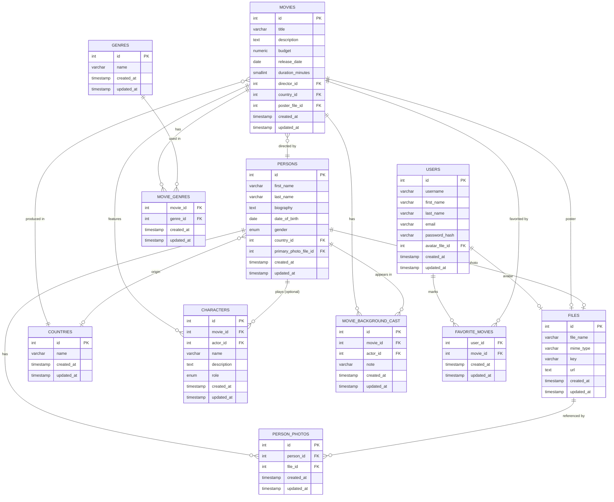

# Movies DB

Спрощена реляційна БД для додатку про фільми (PostgreSQL).

## ER-діаграма

## Ключові рішення

- **files** - окрема таблиця для всіх файлів (S3, один bucket): `file_name`, `mime_type`, `key`, `url`. На неї посилаються `users.avatar_file_id`, `movies.poster_file_id`, `persons.primary_photo_file_id`, `person_photos.file_id`.
- **persons.primary_photo_file_id** зберігає основне фото людини напряму (FK на `files`), а таблиця **person_photos** — додаткові фото для сторінки деталей (many-to-many людина↔файл через окрему таблицю з `id`, бо файл теоретично міг би бути доданий кільком людям).
- **genres / movie_genres** — many-to-many між фільмами й жанрами.
- **characters** — персонаж фільму; `actor_id` **nullable**, бо персонаж може бути не зіграний (напр. анімований без озвучення в БД) або зіграний невідомим актором.
- **movie_background_cast** - окрема таблиця для випадків, коли актор з'явився у фільмі (масовка/фон), але окремого персонажа для нього не створюється. Це дозволяє зафіксувати участь актора без прив'язки до `characters`.
- **favorite_movies** - many-to-many між `users` і `movies` (composite PK).
- Усі enum-подібні поля (`gender`, `characters.role`) реалізовані через PostgreSQL `ENUM` типи, бо мають фіксований детермінований набір значень.
- `budget` - `numeric(14,2)` (точні гроші, без float-помилок); `duration_minutes` — `smallint` з `CHECK > 0`.
- Кожна таблиця має `created_at` / `updated_at`; `updated_at` оновлюється тригером `set_updated_at()`.

## Структура репозиторію

- `ddl.sql` - створення БД (types, tables, indexes, triggers).
- `queries/1_actors_total_movies_budget.sql`
- `queries/2_movies_last_5_years_actor_count.sql`
- `queries/3_users_favorite_movie_ids.sql`
- `queries/4_directors_average_budget.sql`
- `queries/5_movies_filtered_by_criteria.sql`
- `queries/6_movie_details_by_id.sql`
